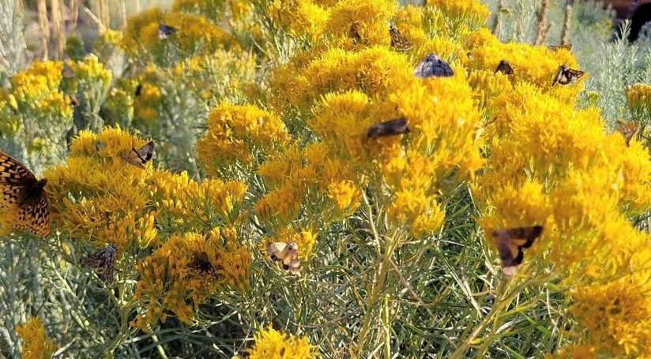
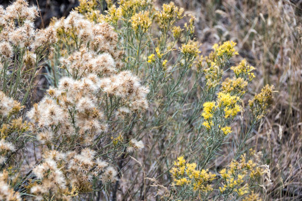
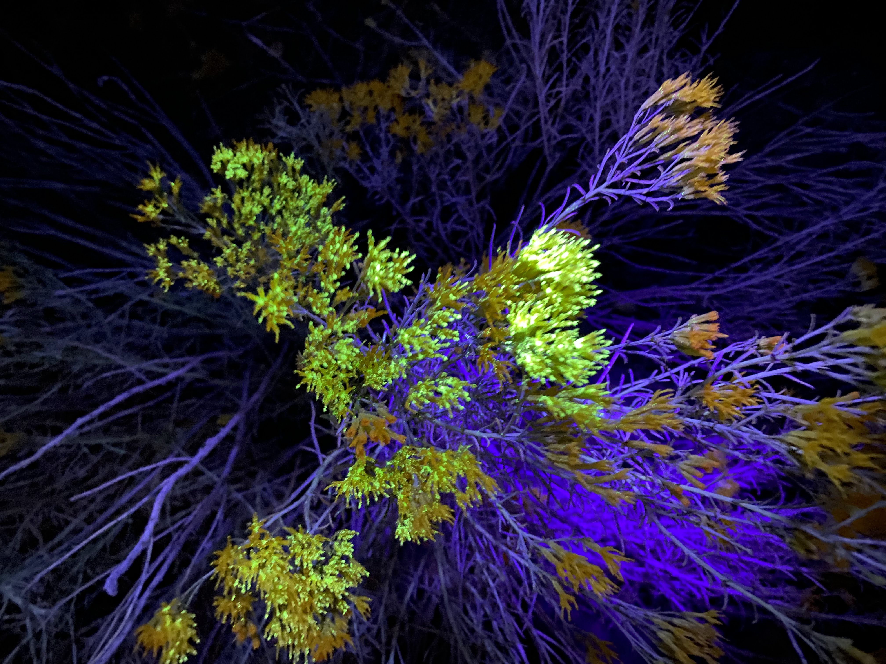
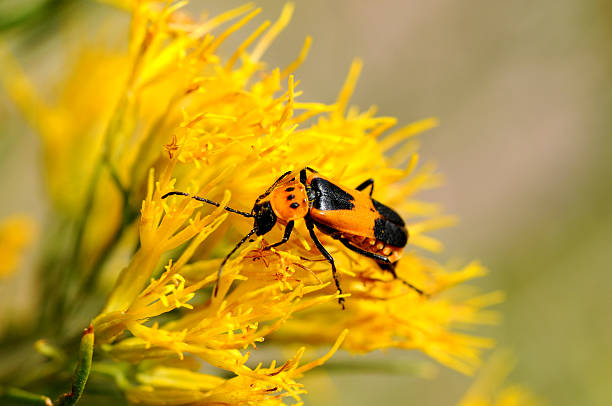

```{css, echo=FALSE}
h1, h4 {
  text-align: center;
  color: #355E3B;
  font-weight: bold;
}
```

```{r setup, include=FALSE}
knitr::opts_chunk$set(echo = TRUE, message= FALSE, warning= FALSE)
library(tidyverse)
library(easystats)
library(broom)
library(janitor)
library(kableExtra)
library(vegan)
library(sp)

```

```{r echo=FALSE, fig.align='center', fig.width=5, fig.height=5}
knitr:: 
```
<br>
There are many factors that contribute to speciation events. Importantly in plants, pollinators can have a large impact on breeding between different individuals. This discrimination of pollinators is driven by a variety of morphological traits in the plant, therefore possibly leading specific pollinators to having a strong plant preference. This knowledge leads to the question: Do pollinators discriminate between subspecies of rabbitbrush? Studying these differences can be important for predicting gene flow and how speciation events may start to occur.
<br>
<br>
Here is some background information about the study organism to better understand the data presented below.
<br>
Rabbitbrush (*Ericameria nauseosa*) is a native perennial shrub in the Asteraceae family. Rabbitbrush has erect stems and commonly has numerous leaves. When flowers bloom in late summer and fall they are bright yellow and are in clusters. Around 21 species of rabbitbrush have been described within North America and placed in gray or green colored groups (genotypes), both of which can be deciduous or non-deciduous. Within these subspecies ranges are variable with some being very narrowly isolated but many being widely distributed with overlapping ranges (McArthur et al., 1986). Within these overlapping subspecies they are often found growing together. Despite these morphological and ecological differences little if any work has been done on the ability of pollinators to discriminate between subspecies, resulting in a significant gap in our knowledge of how these subspecies are maintained. 
<br>
<br>

## Morphology
<br>
First I will read in a csv that shows morphological measurements for each genotype of rabbitbrush at each of the 5 research sites.

```{r echo=FALSE}
Morpho <- read_csv("./Data/Morphology.csv") %>% clean_names() %>% rename(decid=deciduous)
Morpho %>% 
  kable() %>% kable_classic() %>% 
  kable_styling(full_width = T, fixed_thead = T, bootstrap_options = c("striped", "hover", "responsive")) %>% 
  scroll_box(width = "800px", height = "300px")
```
<br>
<br>
<br>

## Seed Germination
<br>

```{r echo=FALSE, fig.width=8, fig.height=8}
knitr:: include_graphics("./Media/germination.gif")

```

One important difference in many plants is the success of their seeds. Seed germination and days till germination can vary widely between plant species. These factors may cause speciation within clusters of sympatrically growing seed plants (Willis et al., 2014). Some plants will put large energy resources into their seeds, allowing for a greater percent germination of their seeds. On the other hand some plants can create more seeds with lower germination and succeed in spreading many propagules with a small but acceptable germination rate. The timing of the germination event can also play a key role in ecological separation as a delay of several weeks may cause plants with differing germination to develop differently.
<br>
<br>
This data set shows germination percentages for each site and how many days it took each genotype to germinate. 

```{r echo = FALSE}
Germ <- read_csv("./Data/Germ_Data.csv") %>% clean_names()

#cleaning the data set:
Germ <- Germ %>% drop_na(color,decid,lat, long, elevation_m) 
  #select(-decid)

#making the decid column a logical vector
decid <- Germ %>% 
  select(decid) %>% 
  mutate(decid = case_when(decid == "Y" ~ TRUE,
                   TRUE ~ FALSE))

Germ <- Germ %>% select(-decid)

#combing the new logical column to the whole data set.
Germ <- Germ %>% bind_cols(decid)

Germ %>% kable %>% kable_classic() %>% 
  kable_styling(full_width = T, fixed_thead = T, bootstrap_options = c("striped", "hover", "responsive")) %>% 
  scroll_box(width = "800px", height = "300px")

```
<br>
<br>

Now to looking at how morphological traits and germination rates relate.
```{r echo = FALSE}
Morph_Germ <- full_join(Germ, Morpho)
## Need to work on this data set

keepersites <- Morpho$site %>% unique()

Morph_Germ <- 
Morph_Germ %>% 
  filter(site %in% keepersites)
Morph_Germ <- Morph_Germ %>% 
  mutate(lat = case_when(site == "Midvale" ~ 40.599478,
                         site == "Provo_Mouth" ~ 40.309836,
                         site == "Bluffdale" ~ 40.480125,
                         TRUE ~ lat),
         long = case_when(site == "Midvale"~ -111.919122,
                          site== "Provo_Mouth" ~ -111.656777,
                          site == "Bluffdale" ~ -111.925104,
                          TRUE ~ long),
         elevation_m= case_when(site == "Midvale" ~1306,
                                site == "Provo_Mouth"~1465,
                                site == "Bluffdale" ~1363,
                                TRUE ~elevation_m),
         decid= case_when(site== "Midvale"~ FALSE,
                          site== "Provo_Mouth" ~ TRUE,
                          TRUE ~ decid))


library(leaflet)

lat <- Morph_Germ$lat
long <- Morph_Germ$long

  
  icons <- awesomeIcons(
  icon = 'star',
  iconColor = 'black',
  library = 'ion',
  markerColor = "green")
  
#map
leaflet(options = leafletOptions(maxZoom=18)) %>%
  addProviderTiles(provider= 'Esri.NatGeoWorldMap', group='Map') %>%
  addProviderTiles(provider='Esri.WorldImagery', group='Satellite') %>%
  addCircleMarkers(lng=Morph_Germ$long,
             lat=Morph_Germ$lat,
             label = Morph_Germ$site,
             radius = 6,
             color = Morph_Germ$germ_per,
             fillColor = Morph_Germ$germ_per,
             opacity = 1,
             fillOpacity = 1
             ) %>%
  addLayersControl(baseGroups=c('Map','Satellite'),
                   options=layersControlOptions(collapsed=FALSE)) %>%
  addScaleBar(position='topleft') %>% 
  addAwesomeMarkers(lng = long, lat=lat, icon=icons)
  

#Plotting some things:
Morph_Germ %>%
  group_by(color) %>% 
  ggplot(aes(x=corolla_length, y=germ_per, fill=color)) +
  geom_boxplot()+
  facet_wrap(scales = "free", ~site)+
  theme_bw()+
  scale_fill_manual(values = c("#6b706b","#19821c"))+
  labs(title = "Germination Percent and Corolla Length", y= "Germination Percent", x= "Corolla Length")+
  theme(plot.title = element_text(hjust = 0.5, size = 15))
  
  

```
<br>
This box plot shows us that green genotypes have a higher germination percent and shorter corolla length compared to the gray genotype that has lower germination percent and longer corolla lengths.
Let's do some statistical testing to see if any of these depictions are significant!

```{r echo= FALSE}
germtest <- t.test(Morph_Germ$corolla_length, Morph_Germ$germ_per, group= Morph_Germ$color )
germtest %>% glimpse()

```
Running a Ttest helps to see that since the p-value is < 0.5 that the germination percent and corolla length depending on the genotype of rabbitbrush is significant. There is quite a difference between the two color groups.
<br>
<br>

## Flowering Phenology
<br>

```{r echo=FALSE, fig.align='center', fig.width=5, fig.height=5}
knitr:: 
```

Flowering phenology and germination go hand in hand. The start and end flowering time of each genotype at each site was observed and that is what the below data set is depicting.
<br>
Cleaning up the phenology data set.
```{r echo= FALSE}
Phen <- read_csv("./Data/Phenology.csv")%>% clean_names() 
Phen$flower_start <- Phen$flower_start %>% as.POSIXct(format= '%m/%d/%Y')
Phen$flower_end <- Phen$flower_end %>% as.POSIXct(format= '%m/%d/%Y') 

Phen %>% kable() %>% kable_classic()
```

Messing around with the flowering start and end time for each color group.
```{r echo= FALSE}
flower_diff <- Phen %>% 
  mutate(flower_time = flower_end - flower_start) %>% 
  group_by(color) %>% 
  summarize(mean_flower_time= (flower_time))
flower_diff %>% glimpse()

Phenology <- Phen %>% 
  mutate(flower_time = flower_end - flower_start,
         flower_time= as.numeric(flower_time))

#Plotting the difference in flowering time.
Phenology%>% 
  ggplot(aes(x=color,y=flower_time))+
  geom_boxplot()

#Statistical testing and modeling.
Ttest <- t.test(Phenology$flower_time, group = Phenology$color)
Ttest %>% glimpse()

#modeling
mod_aov <- aov(data=Phenology,
    formula= flower_time ~color+site)
summary(mod_aov)
TukeyHSD(mod_aov) %>% plot

```

<br>
<br>
<br>

## Pollen Flow With UV Pigments as a Proxy for Pollen
<br>

```{r echo=FALSE, fig.align='center', fig.width=2, fig.height=2}
knitr:: 
```

Pollen flow is such an important factor to consider when studying plant and pollinator interactions.
<br>
**Loading and cleaning the pollen data set**

```{r echo=FALSE}
pollen <- read_csv("./Data/Pollen_Flow.csv") %>% clean_names()
pollen$date <- pollen$date %>% as.POSIXct(format= '%m/%d/%Y') 

pollen <- pollen %>% 
  mutate(green_green= case_when(green_green== "Y"~TRUE, TRUE~FALSE),
        green_gray= case_when(green_gray== "Y"~TRUE, TRUE~FALSE),
        gray_gray= case_when(gray_gray== "Y"~TRUE, TRUE~FALSE),
        gray_green= case_when(gray_green== "Y"~TRUE, TRUE~FALSE))

#plotting it:

pollen %>%
  pivot_longer(starts_with("g")) %>% 
  ggplot(aes(x=site,y=name, fill=value))+
  geom_tile()

```
<br>
**Loading and cleaning another pollen data set with all the pigment found at each site for a duration of 40 minutes per site.**
```{r echo=FALSE}
flow_count <- read_csv("./Data/Pollen_Count.csv") %>% clean_names()

#making the data into longer format

flow_count <- flow_count %>% pivot_longer(cols = green_green:gray_green, names_to = "pigment_movement", values_to = "T_F")

#plotting to see what it looks like:

flow_count %>% 
  ggplot(aes(x=pigment_movement, y= time_point, color= T_F))+
  geom_boxplot()+
  facet_wrap(~site)
##I need to mess around with how to plot this data if I want to use it in my report.

```
<br>
<br>

## Pollinators
<br>
```{r echo=FALSE, fig.align='center', fig.width=3, fig.height=3}
knitr:: 
```


