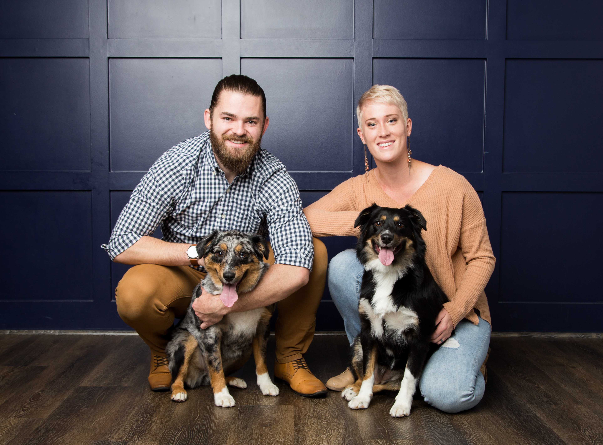

```{r setup, include=FALSE}
knitr::opts_chunk$set(echo = FALSE, warning= FALSE, message= FALSE)

library(tidyverse)
library(vitae)
library(tibble)

```

## [Home]()| [About Me](https://SamIngram29.github.io/Aboutme/)|[Final Project](https://SamIngram29.github.io/Finalproject/Final_Project.html)

```{r fig.align='center', fig.width=5, fig.height=5}
knitr:: 
```


